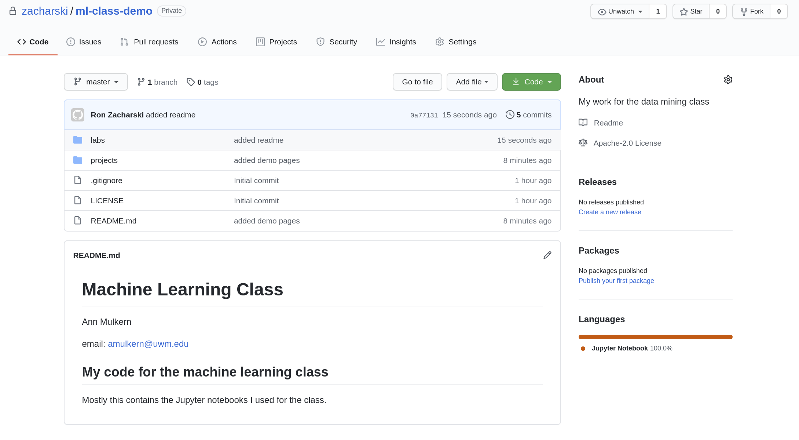
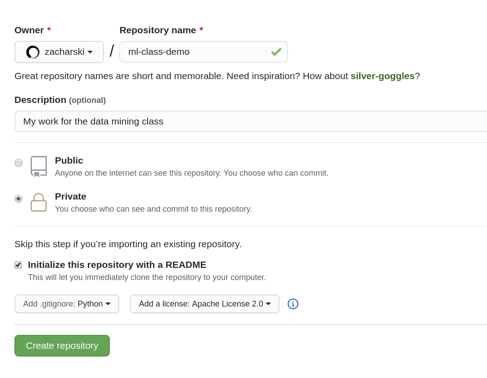
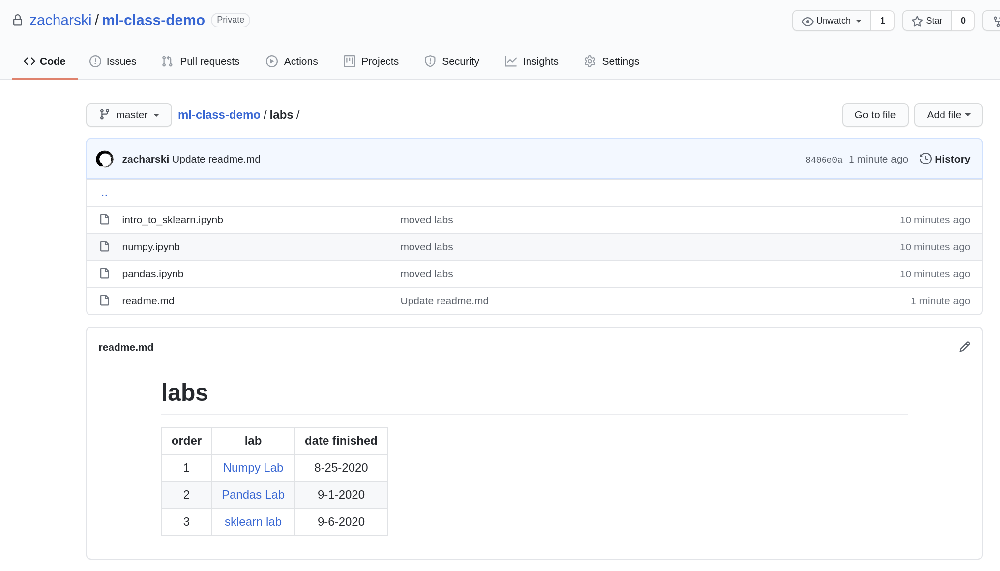

# Github Lab

## Goal

The goal of this lab is to set up the github repository you will use for the entire course. 

## Learning Objectives

* Ability to use basic git commands to create and push a repository. 
* Ability to create basic documentation in Markdown. 

## Task

You should already have solid git skills from other courses you have taken and this task will reinforce those skills. The goal, as stated above, is to create a git repository you will use for the entire course. When you create the repository on github, include a .gitignore file and a readme.md file. When you create your Github repository make sure it is a private repository. Clone the repository to your local computer and make the necessary adds and commits and final push to match the contents shown here:

Here is a screenshot showing when I was creating the repository:

1. Make the repository private. When the class ends you can make it public so you can share your work.

2. The `README.md` markdown file, as shown above. includes your name, email address, one or more Markdown headers, and a short sentence or two.  Notice that I selected the "Initialize this repository with a README" to create a stub.

3. Add a license.

4. `.gitignore` - Github will automatically create this file if you select  the  `.gitignore` option when you create the repository. Please select the Python option of it.

5. The three folders are ones you create and should be named
   
   1. labs
   2. projects
   3. notes
   
   Each of these contains a README.md file. Most of these can just be stubs, but eventually you might add some content. For example.

6. 

When you finish and push your changes, add me as a contributor so I have access to your code:

When you have completed this task submit a link to your github repository by filling out our [Github Repository information form]([Cap4770 Intro to Data Mining](https://docs.google.com/forms/d/e/1FAIpQLSdS5dh7HUnb9N_z7e3p23R3nhW47g-mJcU7b61CXChr9S1OiA/viewform))

