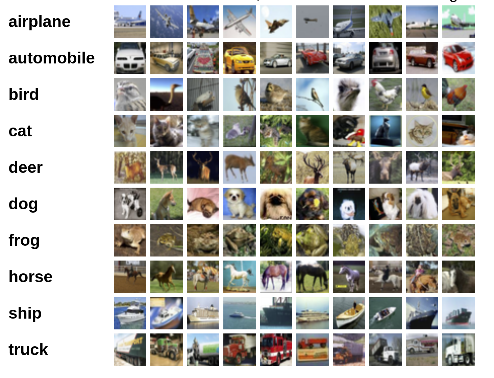
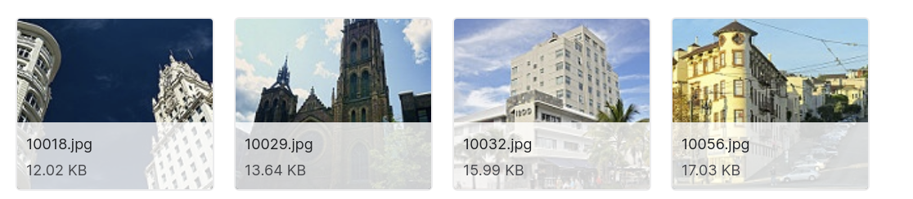
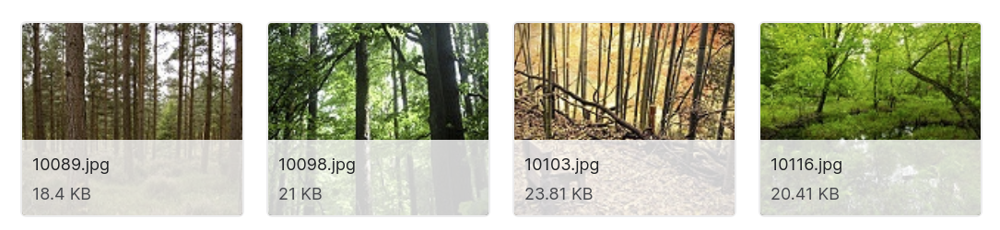
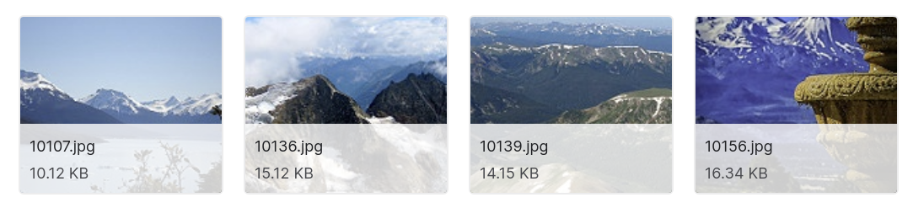

# Image Classification

### [General Readme on Projects](https://github.com/zacharski/ml-class/blob/master/projects/readme.md)

You can work by yourself or with a partner.

We are going to work a bit more with image classification and the goal is to just have a minor step in complexity from what we have been doing. I want this to be a successful experience rather than one of frustration.  You can choose between two datasets.

## The CIFAR-10 dataset

The following is from [Alex Frizhevsky's description](https://www.cs.toronto.edu/~kriz/cifar.html) of the dataset.

The CIFAR-10 and CIFAR-100 are labeled subsets of the [80 million tiny images](http://people.csail.mit.edu/torralba/tinyimages/) dataset. They were collected by Alex Krizhevsky, Vinod Nair, and Geoffrey Hinton.

The CIFAR-10 dataset consists of 60000 32x32 colour images in 10 classes, with 6000 images per class. There are 50000 training images and 10000 test images.

The dataset is divided into five training batches and one test batch, each with 10000 images. The test batch contains exactly 1000 randomly-selected images from each class. The training batches contain the remaining images in random order, but some training batches may contain more images from one class than another. Between them, the training batches contain exactly 5000 images from each class.

Here are the classes in the dataset, as well as 10 random images from each:

The classes are completely mutually exclusive. There is no overlap between automobiles and trucks. "Automobile" includes sedans, SUVs, things of that sort. "Truck" includes only big trucks. Neither includes pickup trucks.

### [Download](https://s3.amazonaws.com/fast-ai-imageclas/cifar10.tgz)

### Discussion

This is similar to the MNIST and clothing datasets. In those the images were 28x28x1. In this one the images are 32x32x3.  Just like MNIST and clothing, this dataset has 10 possible labels.  

I am hoping that you see that this is a slight remix of our work with MNIST and clothing.

This dataset is widely used today for performance testing of new deep learning methods. 

## Intel Image Classification

### Data

[Dataset from Kaggle](https://www.kaggle.com/puneet6060/intel-image-classification)

The data is divided into training, testing, and prediction datasets. There are 25,000 images.

You are to  classify the images in one of six categories

{'buildings' -> 0,
'forest' -> 1,
'glacier' -> 2,
'mountain' -> 3,
'sea' -> 4,
'street' -> 5 }

The images are 150x150x3. This is similar to the dog/cat dataset we already worked with. In the dog/cat dataset the task was a binary classification (dog or not). In this one, again, there are 6 categories. So some similarities and some differences.

## Any other image classification dataset that interests you

Of course if you are interested in some other dataset feel free to use it. 

## Submission

Your Python notebook needs to contain text describing the problem and your step-by-step approach.
